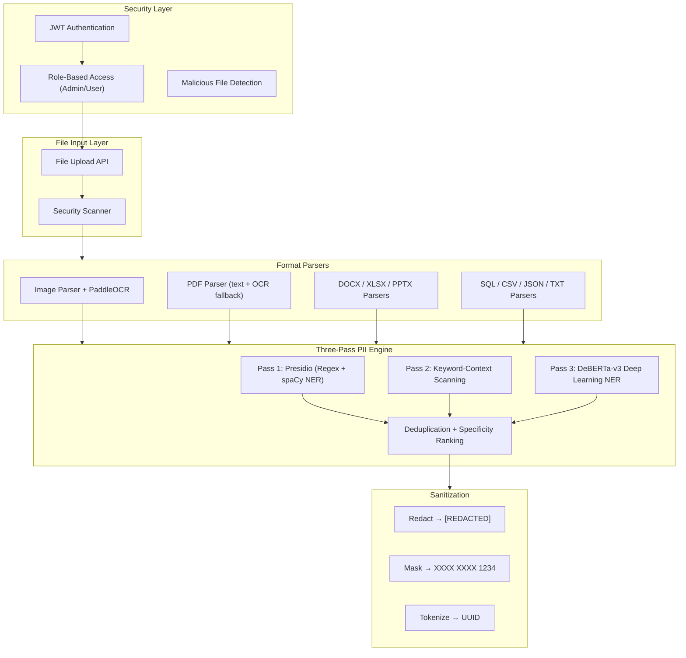

<p align="center">
  
  
  
  
  
  
  
</p>

# 🔒 PII Sanitizer — Information Security Tool

> An automated PII detection and redaction engine that identifies and sanitizes **Aadhaar, PAN, phone numbers, emails, bank accounts, passports, and 20+ other PII types** from images, PDFs, Office documents, SQL, CSV, and JSON files using a **three-pass detection pipeline** (Presidio + Keyword Context + DeBERTa NER).

<p align="center">
  <a href="https://aryan1211-pii-sanitizer.hf.space">
    
  </a>
  <a href="https://huggingface.co/spaces/aryan1211/pii-sanitizer">
    
  </a>
</p>

---

## ✨ Key Features

| Feature | Description |
|---------|-------------|
| **🔍 Three-Pass PII Detection** | Presidio regex+spaCy NER → Keyword-context scanning → DeBERTa-v3 deep learning NER |
| **🇮🇳 India-Specific PII** | Aadhaar (12-digit), PAN (ABCDE1234F), Indian passports, IFSC codes, UPI IDs, Indian phone numbers |
| **📄 20+ File Formats** | Images (PNG/JPG/TIFF/BMP/WebP/GIF/HEIC), PDF, DOCX, XLSX, PPTX, SQL, CSV, JSON, XML, TXT |
| **🖼️ OCR-Based Detection** | PaddleOCR PP-OCRv4 extracts text from scanned documents and images for PII detection |
| **🛡️ Three Sanitization Modes** | **Redact** (`[REDACTED]`), **Mask** (partial reveal: `XXXX XXXX 1234`), **Tokenize** (UUID replacement) |
| **⚡ Batch Processing** | Groups texts into 50K-char batches for high-throughput processing |
| **🔐 File Security Scanner** | Magic byte verification, VBA macro detection, DDE injection, SQL injection, CSV formula injection, polyglot detection |
| **🔑 JWT Authentication** | Role-based access control (Admin/User) with password hashing via passlib+bcrypt |
| **📊 Web Dashboard** | FastAPI-served frontend for file upload, real-time processing, and sanitized output download |
| **🐳 Docker Ready** | GPU-accelerated Docker image based on PaddlePaddle CUDA base |

---

## 🏗️ Architecture



---

## 🛠️ Tech Stack

| Layer | Technology |
|-------|-----------|
| **Backend** | FastAPI + Uvicorn (ASGI) |
| **PII Detection** | Microsoft Presidio + Custom regex recognizers |
| **Deep Learning NER** | DeBERTa-v3 (Hugging Face Transformers) |
| **OCR Engine** | PaddleOCR PP-OCRv4 (80+ languages, GPU/CPU) |
| **Database** | SQLAlchemy ORM + SQLite |
| **Auth** | JWT (python-jose) + bcrypt (passlib) |
| **File Processing** | PyMuPDF (PDF), python-docx, openpyxl, python-pptx, sqlparse |
| **Security** | Magic byte validation, macro detection, injection scanning |
| **Encryption** | cryptography (Fernet symmetric encryption) |
| **Frontend** | HTML/CSS/JS served via FastAPI static files |

---

## 🔐 Security Features

### File Upload Security (`security.py` — 544 lines)

| Check | Description |
|-------|-------------|
| **Magic Byte Verification** | Validates file headers against 15+ known signatures (PNG, JPEG, PDF, PE, ELF, Mach-O) |
| **Extension Whitelist** | Only 25 approved extensions allowed |
| **Double Extension Detection** | Rejects `file.exe.pdf` style attacks |
| **MIME Type Verification** | Cross-checks extension against detected content type |
| **VBA Macro Detection** | Scans DOCX/XLSX/PPTX for `vbaproject.bin`, `vbadata.xml` |
| **DDE Injection Detection** | Detects `=DDE()`, `=CMD|` in spreadsheets and documents |
| **Template Injection** | Scans Office `.rels` files for external template references |
| **PDF JavaScript/Launch** | Blocks PDFs with `/JavaScript`, `/Launch`, `/OpenAction` |
| **SQL Injection Scanning** | Detects `DROP TABLE`, `xp_cmdshell`, `LOAD_FILE`, `INTO OUTFILE` |
| **CSV Formula Injection** | Blocks cells starting with `=CMD(`, `=SYSTEM(`, `|powershell` |
| **JSON Prototype Pollution** | Detects `__proto__`, `constructor` keys |
| **JSON Depth Bomb** | Limits nesting to 50 levels |
| **Image Decompression Bomb** | Blocks images exceeding 100 megapixels |
| **Polyglot Detection** | Detects `<html>`, `<script>`, `<?php>` embedded in images |
| **EXIF Script Injection** | Scans image metadata for JavaScript payloads |
| **Base64 PE Detection** | Detects base64-encoded executables in text files |
| **Executable Detection** | Blocks PE, ELF, Mach-O binaries and shebang scripts |

---

## 🎯 Supported PII Types (20+)

| Category | PII Types |
|----------|-----------|
| **Identity** | Aadhaar (IN_AADHAAR), PAN (IN_PAN), Passport (IN_PASSPORT), Person Name |
| **Contact** | Phone Number, Email Address, Location/Address |
| **Financial** | Bank Account, IFSC Code, Credit Card, UPI ID, Bank Name |
| **Personal** | Date of Birth, IP Address |
| **Technical** | Device ID (IMEI), Hash Value, Biometric Template |
| **Generic** | URL, Username, ID Number |

---

## 📁 Project Structure

```
pii-sanitizer/
├── app/
│   ├── main.py              # FastAPI app + lifespan (auto-seeds admin user)
│   ├── pii_engine.py         # Three-pass PII detection + sanitization engine
│   ├── recognizers.py        # 15+ custom regex recognizers (Aadhaar, PAN, IFSC, etc.)
│   ├── deberta_ner.py        # DeBERTa-v3 NER integration (Hugging Face)
│   ├── ocr_engine.py         # PaddleOCR wrapper (preprocessing, postprocessing)
│   ├── security.py           # 544-line malicious file scanner
│   ├── parser_image.py       # Image OCR + PII bounding box redaction
│   ├── parser_pdf.py         # PDF text extraction + OCR fallback
│   ├── parser_docx.py        # Word document parser
│   ├── parser_pptx.py        # PowerPoint parser
│   ├── parser_xlsx.py        # Excel parser
│   ├── parser_sql.py         # SQL file parser
│   ├── parser_data.py        # CSV / JSON parser
│   ├── parser_txt.py         # Plain text parser
│   ├── parsers.py            # Format router + extension mapping
│   ├── converter.py          # File format conversion utilities
│   ├── routes_auth.py        # Auth endpoints (register/login)
│   ├── routes_files.py       # File upload + sanitization endpoints
│   ├── auth.py               # JWT + bcrypt auth utilities
│   ├── models.py             # SQLAlchemy models (User, Role)
│   ├── schemas.py            # Pydantic request/response schemas
│   ├── database.py           # SQLAlchemy engine setup
│   ├── config.py             # App settings (Pydantic Settings)
│   └── encryption.py         # Fernet symmetric encryption
├── static/
│   └── index.html            # Web dashboard frontend
├── sample_data/              # Sample test files
├── ocr_config.yaml           # PaddleOCR configuration (GPU, lang, preprocessing)
├── requirements.txt          # Python dependencies
├── run.bat / run.sh          # Quick start scripts
└── README.md
```

---

## 🚀 Quick Start

### Prerequisites
- Python 3.10+
- pip

### 1. Install Dependencies

```bash
pip install -r requirements.txt
python -m spacy download en_core_web_sm
```

### 2. Run the Server

```bash
# Windows
run.bat

# Linux/Mac
chmod +x run.sh && ./run.sh

# Or manually
uvicorn app.main:app --host 0.0.0.0 --port 8000 --reload
```

### 3. Open Dashboard
Visit `http://localhost:8000` 🎉

### Default Admin Account
- Email: `admin@local.dev`
- Password: `admin123`

---

## 📊 API Endpoints

| Method | Endpoint | Description | Auth |
|--------|----------|-------------|------|
| `POST` | `/auth/register` | Register new user | Public |
| `POST` | `/auth/login` | Login and get JWT token | Public |
| `POST` | `/files/upload` | Upload file for PII sanitization | JWT |
| `GET` | `/files/` | List uploaded files | JWT |
| `GET` | `/files/{id}/download` | Download sanitized file | JWT |

---

## 🐳 Docker

```bash
docker build -t pii-sanitizer .
docker run -p 8000:8000 pii-sanitizer
```

---

## 👨‍💻 Author

**Aryan Bhalodiya**
- GitHub: [@aryan1919-web](https://github.com/aryan1919-web)
- LinkedIn: [Aryan Bhalodiya](https://www.linkedin.com/in/aryan-bhalodiya31)

## 📄 License

This project is licensed under the MIT License.
